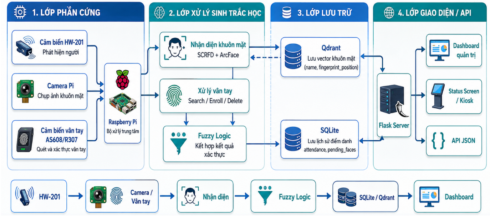
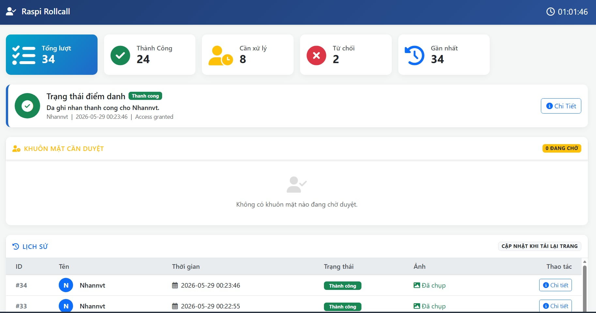
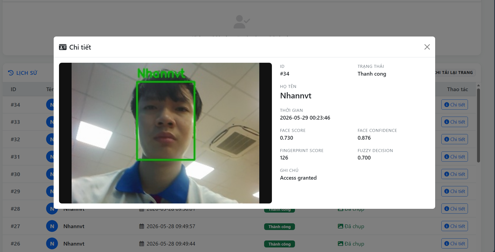
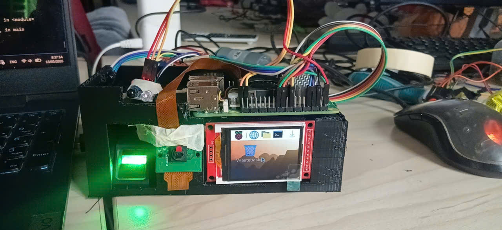
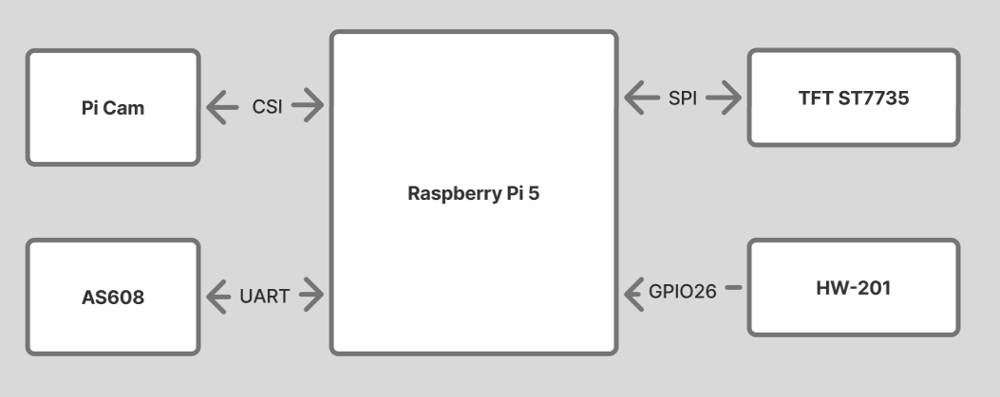

# Raspi Rollcall

Raspi Rollcall là hệ thống điểm danh và xác thực ra vào trên Raspberry Pi, kết hợp nhận diện khuôn mặt, vân tay, cảm biến kích hoạt, cơ sở dữ liệu vector và dashboard quản trị. Hệ thống được thiết kế theo hướng kiosk tại chỗ: khi có người dùng đến gần thiết bị, pipeline tự động chụp ảnh, nhận diện, quét vân tay, suy luận kết quả và ghi nhận lịch sử.

## Tổng Quan Hệ Thống

Hệ thống gồm 4 lớp chính:

1. **Phần cứng nhúng:** Raspberry Pi, camera, cảm biến vật cản HW-201 và cảm biến vân tay AS608/R307.
2. **Xử lý sinh trắc học:** SCRFD phát hiện khuôn mặt, ArcFace tạo embedding, AS608 xử lý mẫu vân tay.
3. **Ra quyết định:** Fuzzy Logic kết hợp độ tin cậy khuôn mặt và điểm trùng khớp vân tay để đưa ra điểm `decision`.
4. **Lưu trữ và giao diện:** Qdrant lưu vector khuôn mặt, SQLite lưu lịch sử điểm danh, Flask cung cấp dashboard và màn hình kiosk.

Luồng xử lý tổng quát:

```text
HW-201 detect
    -> Camera capture
    -> Face detection + face embedding
    -> Qdrant search
    -> Fingerprint search/enroll
    -> Fuzzy decision
    -> SQLite record
    -> Dashboard/status screen
```

## Chức Năng Chính

- Tự động kích hoạt điểm danh khi HW-201 phát hiện người.
- Nhận diện khuôn mặt bằng SCRFD và ArcFace.
- Lưu và tìm kiếm embedding khuôn mặt trong Qdrant.
- Quét, tìm kiếm, đăng ký và xóa vân tay trên AS608/R307.
- Kết hợp hai kênh sinh trắc học bằng logic mờ để xử lý trường hợp không chắc chắn.
- Ghi lịch sử điểm danh, ảnh chụp, điểm khuôn mặt, điểm vân tay và kết quả suy luận vào SQLite.
- Hỗ trợ dashboard quản trị để xem thống kê, lịch sử, duyệt khuôn mặt mới và xử lý lượt cần xác minh.
- Hỗ trợ màn hình kiosk hiển thị trạng thái điểm danh theo thời gian gần thực.
- Có script reset dữ liệu SQLite, Qdrant, ảnh chụp và template vân tay.

## Công Nghệ Sử Dụng

| Thành phần | Công nghệ |
| --- | --- |
| Backend/API | Flask |
| Giao diện | HTML, Bootstrap, Font Awesome, JavaScript |
| Cơ sở dữ liệu cục bộ | SQLite |
| Vector database | Qdrant |
| Nhận diện khuôn mặt | SCRFD, ArcFace, ONNX Runtime |
| Camera | Picamera2 |
| Vân tay | pyfingerprint, AS608/R307 |
| Cảm biến kích hoạt | gpiozero, lgpio, HW-201 |
| Suy luận quyết định | scikit-fuzzy |
| Đóng gói dịch vụ | Docker Compose |


## Sơ đồ tổng quan hệ thống:



Giao diện dashboard và màn hình chi tiết:

<p align="center">
  
  
</p>

Phần cứng triển khai và sơ đồ kiến trúc:

<p align="center">
  
  
</p>

## Demo

Video demo hệ thống:

[Xem video demo](asset/video_demo.mp4)

## Logic Mờ

Hệ thống sử dụng **Mamdani Fuzzy Inference System** để kết hợp hai biến đầu vào:

- `face_confidence`: độ tin cậy của kênh nhận diện khuôn mặt.
- `fingerprint_score`: điểm trùng khớp mẫu vân tay từ cảm biến AS608/R307.

Biến đầu ra là `decision` trong khoảng `[0, 1]`, sau đó được phân loại thành:

- `Accept`: chấp nhận điểm danh.
- `Uncertain`: cần xác minh lại hoặc đưa vào dashboard xử lý.
- `Reject`: từ chối điểm danh.

Nếu môi trường chạy không cài được `scikit-fuzzy`, hệ thống có thể dùng fallback tính điểm trọng số:

```text
decision = fingerprint_score_norm * 0.55 + face_confidence * 0.45
```

Trong đó kênh vân tay được ưu tiên cao hơn vì có tính đặc trưng sinh trắc học ổn định hơn kênh hình ảnh camera.

## Cấu Trúc Thư Mục

```text
raspi_rollcall/
├── server.py                         # Flask server, dashboard, API
├── attendance_store.py               # SQLite schema và hàm ghi dữ liệu
├── app/
│   ├── app.py                        # Pipeline face + fingerprint + fuzzy
│   └── config.json                   # Cấu hình hệ thống
├── core/
│   ├── paths.py                      # Quản lý đường dẫn dự án
│   └── src/
│       ├── AS608.py                  # Driver cảm biến vân tay
│       ├── HW_201.py                 # Driver cảm biến vật cản
│       ├── camera.py                 # Wrapper Picamera2
│       ├── database.py               # Qdrant HTTP client
│       └── model.py                  # FaceModel và FuzzyModel
├── templates/
│   ├── index.html                    # Dashboard quản trị
│   └── status_screen.html            # Màn hình kiosk
├── data/
│   ├── rollcall.db                   # SQLite runtime
│   └── captures/                     # Ảnh chụp điểm danh
├── weights/                          # ONNX model weights
├── docker_compose/
│   └── docker-compose.yml            # Qdrant và backend
└── scripts/                          # Script reset và kiosk autostart
```

## Cài Đặt

Cài các gói hệ thống trên Raspberry Pi:

```bash
sudo bash setup.bash
```

Cài Python dependencies:

```bash
pip install -r requirements.txt
```

Khởi động Qdrant:

```bash
docker compose -f docker_compose/docker-compose.yml up -d qdrant
```

Chạy Flask server và pipeline:

```bash
python server.py
```

Dashboard mặc định:

```text
http://<raspberry-pi-ip>:5000/
```

Màn hình kiosk:

```text
http://<raspberry-pi-ip>:5000/status-screen
```

## Cấu Hình

File cấu hình chính nằm tại:

```text
app/config.json
```

Một số tham số quan trọng:

- `sensor_pin`: chân GPIO của cảm biến HW-201.
- `camera_width`, `camera_height`, `camera_framerate`: cấu hình camera.
- `face_confidence_thresh`: ngưỡng confidence phát hiện khuôn mặt.
- `face_threshold`: ngưỡng tìm kiếm khuôn mặt trong Qdrant.
- `face_timeout`, `fp_timeout`: timeout cho worker khuôn mặt và vân tay.
- `qdrant_host`, `qdrant_port`: địa chỉ Qdrant.

Biến môi trường `QDRANT_HOST` và `QDRANT_PORT` có thể override cấu hình Qdrant.

## Reset Dữ Liệu

Script reset:

```bash
python scripts/clean_reset.py
```

Script này có thể xóa SQLite database, ảnh chụp, Qdrant collection và template vân tay trên cảm biến. Để bỏ qua bước xác nhận:

```bash
python scripts/clean_reset.py --yes
```

## Kiểm Thử Nhanh Logic Mờ

Có thể chạy trực tiếp module model để in bảng kết quả fuzzy với các cặp điểm mẫu:

```bash
python core/src/model.py
```

Một số điều kiện cần đảm bảo khi kiểm thử:

```python
decision = fuzzy.make_decision(fingerprint_score, face_confidence)
assert 0.0 <= decision <= 1.0
assert fuzzy.classify_decision(decision) in {"Accept", "Uncertain", "Reject"}
```

## Ghi Chú Vận Hành

- Pipeline phụ thuộc phần cứng thật, cần kiểm tra quyền truy cập camera, UART và GPIO.
- Nếu chạy trong Docker, cần mount đúng các thiết bị như `/dev/video*`, `/dev/gpiochip*`, `/dev/gpiomem` và UART.
- Dashboard hiện dùng CDN Bootstrap/Font Awesome, nên cần internet hoặc cache cục bộ để hiển thị đầy đủ giao diện.
- Khi mở rộng hệ thống, nên bổ sung authentication cho dashboard và test tự động cho SQLite, Qdrant wrapper, Flask API và FuzzyModel.
